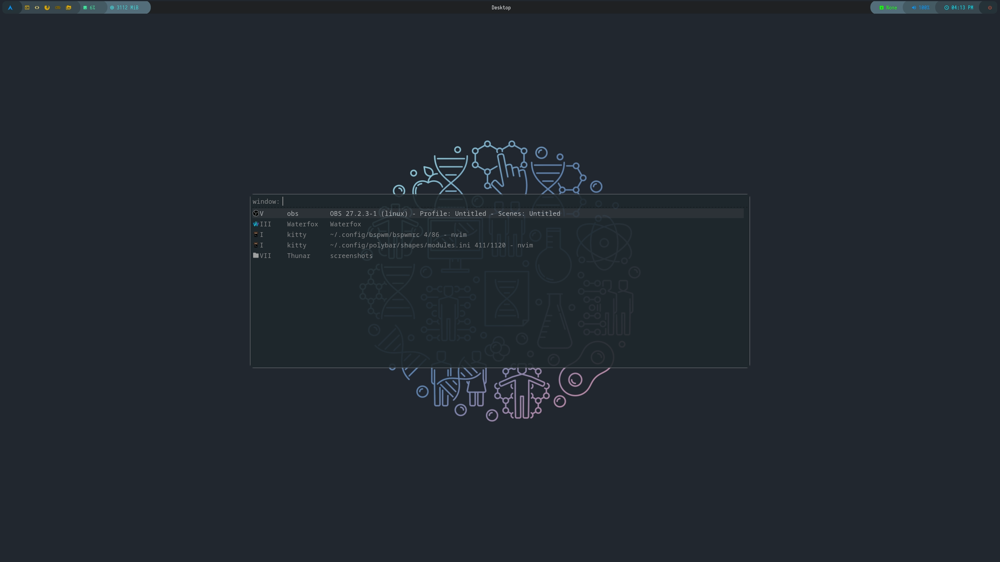
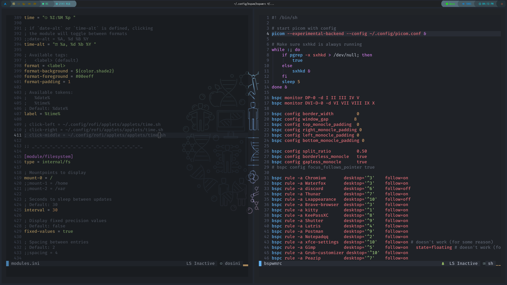
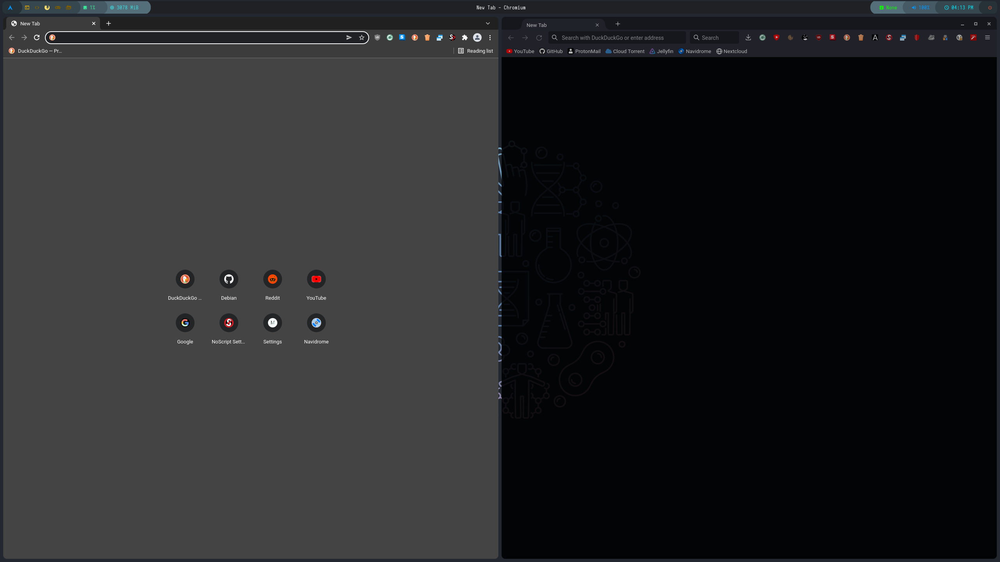

# ArchObscurely
Automated Arch Linux Install for my Machine. Mostly automatic, you still need to answer some prompts, but you have to whatch it anyway in case it errors out in some part so you know what to fix. Erros will still appear over the time even tho it works now, because I don't know when a new package update will break the script.

## How to use it on your machine
Just change everything in the first file regarding the paritioning. In the second file just change the first line to your grub partition (boot). In order to make it easier you can fork this to apply your changes.

## How to use the script
First download the arch iso and run it, obviously. Then run this commands.

```shell
sudo pacman -S archlinux-keyring
```
```shell
sudo pacman -Sy git
```
```shell
git clone https://github.com/Obscurely/ArchObscurely
```
```shell
cd ArchObscurely
```
And here run depending which script you changed or want to use
```shell
./archobscurely.sh
```
or
```shell
./archobscurely-dual-boot.sh
```

## Screenshots

### Screen 1


### Screen 2


### App launcher


### Quick apps


### Time


### App switcher


### Terms side by side


### Browsers side by side

